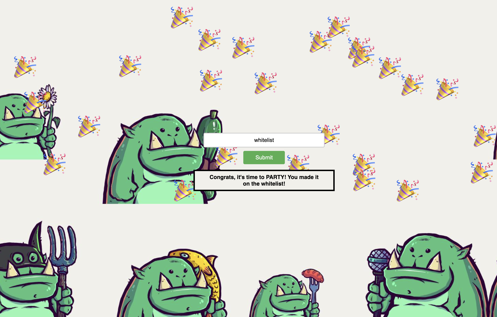

# NFT Whitelist App (for Silo The Farmors)



A simple app to help users know if they are whitelisted or not for an NFT mint.

There are three categories of users:
* whiteliste
* waitlist
* reject

This was made with Vue! Happy minting!

## Project setup
```
npm install
```

This was last built and tested with npm version 10.5.0 on MacOS Sonoma 14.4.1.

### Compiles and hot-reloads for development
```
npm run serve
```

### Compiles and minifies for production
```
npm run build
```

### Lints and fixes files
```
npm run lint
```

### Deployment

This app was deployed with AWS Amplify. An application was started, the github repository was linked, and the app auto-built and deployed each push to main.

### Acknowledgements

Made with 💙 from Engelgirl and Crypto Kyru.
